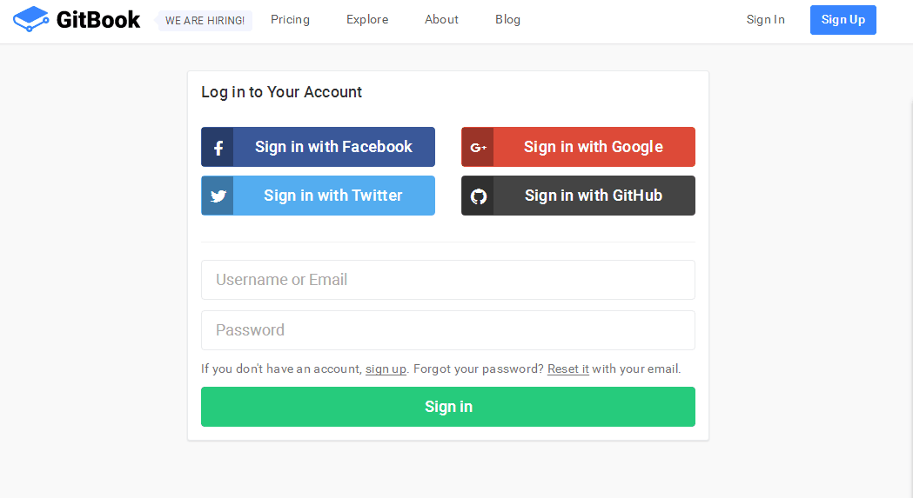
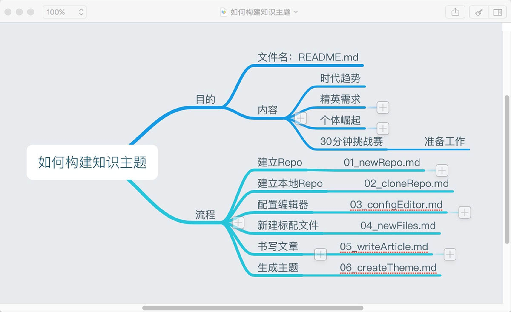

#准备工具：

1. 注册Github账户，地址：<http://www.github.com>

2. 注册Gitbook账户，地址：<http://www.gitbook.com>，这里选择Sign in，并且使用刚才注册好的Github账户来sign in。这样可以保证Gitbook可以读取你的每个Repo。

选择最后一个黑色的就可以直接sign in。

3. 下载Github Desktop客户端，地址：<http://desktop.github.com> 
       如果无法下载的话，请使用离线下载地址： github离线安装包（windows）的下载地址：  <https://github-windows.s3.amazonaws.com/standalone/GitHubDesktop.exe>
4. 准备一个Markdown编辑器，推荐：MarkdownPad（windows）、Ulysses（OS）、MarkEditor（通用）。 
5. 准备一个知识主题，这个主题可以很小，可以是你的某个工作、一篇读书笔记都可以。请说明：你为什么要选择这个主题（就类似于你看的这篇文章）、这个主题的框架或者流程等。

知识主题的范例如下：

